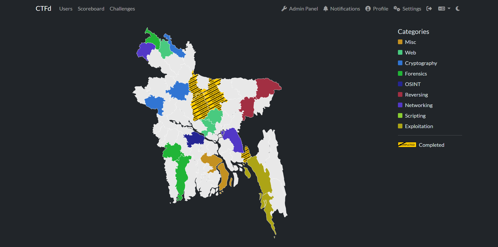

# Bangladesh

A CTFd theme that replaces the standard challenge grid with an interactive **Bangladesh map** (64 districts), inspired by [ColdHeat/UnitedStates](https://github.com/ColdHeat/UnitedStates). Each district represents one challenge (or a connected series of challenges), colored by category, with a ribbon overlay when fully solved.

 

---

## Compatibility

Built on CTFd's `core`/`core-beta` theme architecture (Bootstrap 5 + Alpine.js + Vite), which has shipped as CTFd's default theme since **3.8.0** (and was available as an installable theme from ~3.5.0 onward).

- **Works on:** CTFd 3.x running the core-beta-lineage theme system. Tested on CTFd `3.8.7`.
- **Not compatible with:** CTFd < 3.5, which used the older Bootstrap 4 theme with a different template structure. It is also **not** related to or compatible with the old [ColdHeat/UnitedStates](https://github.com/ColdHeat/UnitedStates) theme, which targets CTFd 1.x (jQuery + Mapael, no build step) - this repo is a from-scratch reimplementation for the modern theme system, not a port.
- CTFd doesn't guarantee template/API stability across every minor version, so if you're on an edge-case 3.x release and something doesn't load, check the CTFd version you tested against above first.

---

## Features

- **64-district map of Bangladesh** - one district per challenge by default
- **Category-based coloring** - each category gets a unique, stable color (hashed from the category name, so it holds up even as you add more categories)
- **Connected challenge series** - tag multiple related challenges with the same district to group them under one pin (click → list of challenges)
- **Completion ribbons** - solved districts (or fully-solved series) get a yellow "COMPLETED" ribbon instead of a flat color change
- **Click-to-open** - clicking a district opens the challenge modal directly
- **Category legend** with live color samples
- **Auto-assignment** - untagged challenges are automatically placed on the next free district

---

## Preview



---

## Installation

There are two ways to install this theme, depending on what's in the release/repo you're using:

- **[Option A - Drop-in prebuilt theme](#option-a--drop-in-prebuilt-theme)** - fastest, no Node/Yarn required, just files copied into `themes/`
- **[Option B - Build from source](#option-b--build-from-source)** - for editing the theme (colors, districts, ribbons) or if you're using a source-only release

If you only want to *use* the theme as-is, go with Option A. If you want to *customize* it, use Option B.

---

### Option A - Drop-in prebuilt theme

Use this if the repo/release you have includes a `static/` folder with compiled JS/CSS already in it.

**Requirements:** none beyond a working CTFd 3.x install - no Node, no Yarn.

1. Copy (or clone) the whole theme folder into your CTFd `themes/` directory:

   ```bash
   git clone https://github.com/h4x0r3rr0r/Bangladesh.git CTFd/themes/Bangladesh
   ```

   Or unzip a release archive directly into `CTFd/themes/Bangladesh`.

2. Restart CTFd so the new theme's static assets are picked up:

   ```bash
   docker compose restart ctfd
   # or: docker restart <ctfd-container-name>
   ```

3. In CTFd, go to **Admin Panel → Config → Theme**, select **Bangladesh**, and save.

4. Hard-refresh the public **Challenges** page (`Ctrl+Shift+R`) to clear cached assets.

That's it - CTFd serves directly from the prebuilt `static/` folder, no compilation needed.

---

### Option B - Build from source

Use this if the repo you have contains only `templates/` and `assets/` (source), with no `static/` folder - or if you want to modify the theme yourself (edit district colors, add ribbon styles, change the map, etc.).

**Requirements:**
- Node.js 16.x
- Yarn (or npm)

#### Steps

```bash
# 1. Clone into your CTFd themes directory
git clone https://github.com/h4x0r3rr0r/Bangladesh.git CTFd/themes/Bangladesh
cd CTFd/themes/Bangladesh

# 2. Install dependencies
yarn install
# or: npm install

# 3. Build
yarn build
# or: npm run build
```

This compiles `assets/` (SCSS, JS - including the district data and map logic, images) into `static/`, which is what CTFd actually serves at runtime. CTFd loads from `static/`, never from `assets/` directly.

#### Restart CTFd

```bash
docker compose restart ctfd
# or: docker restart <ctfd-container-name>
```

Then go to **Admin Panel → Config → Theme**, select **Bangladesh**, save, and hard-refresh `/challenges`.

#### Developing / editing the map

```bash
yarn dev
```

This runs `vite build --watch` - every time you edit a file in `assets/` (e.g. the district data file, or the SCSS for ribbon styles), it rebuilds automatically. Refresh the browser to see changes.

#### Formatting

```bash
yarn format   # auto-formats assets/ with Prettier
yarn lint     # checks formatting without writing changes
```

---

## Usage

### Pinning a challenge to a specific district

1. **Admin Panel → Challenges** → open (or create) a challenge
2. Go to the **Tags** tab
3. Add the district ID in **lowercase** (e.g. `dhaka`, `sylhet`, `coxsbazar`)
4. Save the challenge, then hard-refresh `/challenges`

> **Rules:** tags must be lowercase, use the exact district ID (see list below), and only the first matching free district tag is used per challenge. Untagged challenges are auto-assigned to the next free district.

### Grouping connected challenges on one district

Give every challenge in a series the **same district tag**. For example, three connected OSINT challenges tagged `feni` will all appear under a single pin - clicking it opens a small list to choose from.

Standalone challenges in the same category can each use their own district (e.g. `tangail`, `faridpur`) - they don't need to share a district just because they share a category.

### Completion behavior

| District state | Appearance |
|---|---|
| No challenge assigned | Light gray, solid |
| Has challenge(s) | Solid category color |
| All challenge(s) on that district solved | Yellow **COMPLETED** ribbon (black border), replacing the solid color |
| Series partially solved | Still shows the category color until every challenge in the series is solved |

### Full list of district IDs (64 districts, by division)

```
Barishal:
    barguna, barishal, bhola, jhalokati, patuakhali, pirojpur

Chattogram:
    bandarban, brahmanbaria, chandpur, chattogram, cumilla,
    coxsbazar, feni, khagrachhari, lakshmipur, noakhali, rangamati

Dhaka:
    dhaka, faridpur, gazipur, gopalganj, kishoreganj, madaripur,
    manikganj, munshiganj, narayanganj, narsingdi,
    rajbari, shariatpur, tangail

Khulna:
    bagerhat, chuadanga, jashore, jhenaidah, khulna, kushtia,
    magura, meherpur, narail, satkhira

Mymensingh:
    jamalpur, mymensingh, netrokona, sherpur

Rajshahi:
    bogura, chapainawabganj, joypurhat, naogaon, natore, pabna,
    rajshahi, sirajganj

Rangpur:
    dinajpur, gaibandha, kurigram, lalmonirhat, nilphamari,
    panchagarh, rangpur, thakurgaon

Sylhet:
    habiganj, moulvibazar, sunamganj, sylhet
```

> **Note:** if you have more than 64 challenges, only the first 64 (by tag/auto-assignment order) will appear on the map. Extras won't get a district - either keep challenge count ≤ 64, group more challenges into connected series per district, or add a fallback list UI below the map for overflow challenges.

---

## How category colors work

Colors are generated by hashing each category name (FNV-1a) into an HSL value, so:

- The same category name always produces the same color, for every user, across reloads
- Colors stay visually distinct even as you add more categories
- No manual color mapping is required when new categories are introduced

If two category names ever end up visually similar, rename one slightly, or swap the color function for index-based palette assignment (guarantees no collisions, at the cost of colors shifting if category order changes).

---

## Project structure

```
Bangladesh/
├── templates/               # Challenge page templates (loads the map)
│   ├── challenges.html
│   ├── challenge.html
│   └── base.html
├── assets/                  # SOURCE files - edit these
│   ├── js/
│   │   └── bd_districts.js  # District data, map/challenge assignment logic
│   └── scss/                # Ribbon patterns, category legend styling
├── static/                  # BUILT output - what CTFd actually serves
│                            # (present only if using a prebuilt release,
│                            #  otherwise generate by `yarn build`)
├── package.json
├── vite.config.js
├── .github/workflows/       # CI: lint/build checks
└── README.md
```

---

## Known limitations

- One district per standalone challenge - grouping is done manually via shared tags, not automatically
- Map supports up to 64 challenges natively (one per district); beyond that, extras need either a fallback list or district reuse
- District boundaries are simplified/stylized, not survey-accurate

---

## Credits

- Inspired by [ColdHeat/UnitedStates](https://github.com/ColdHeat/UnitedStates) (CTFd 1.x US-map theme)
- Rebuilt from scratch for the CTFd 3.x core-beta theme system (Alpine.js + Vite), with Bangladesh's 64 districts, category-color hashing, connected-challenge districts, and completion ribbons
